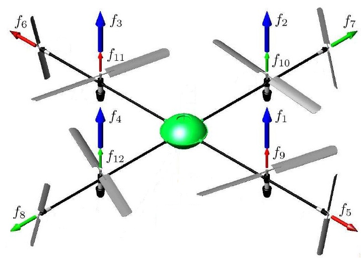
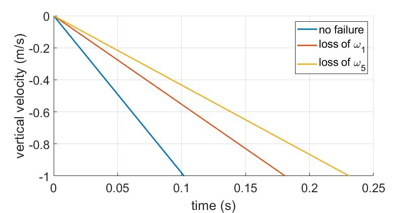
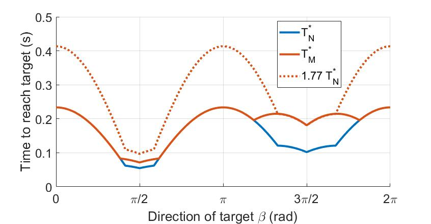

# Quantitative Resilience of Generalized Integrators

This projects contains the codes used in the paper [Quantitative Resilience of Generalized Integrators](https://arxiv.org/abs/2111.04163) to be published soon in the IEEE Transactions of Automatic Control. 


## Quantitative resilience framework

This work focuses on quantifying the resilience of linear systems of nominal dynamics
$$\dot{x}(t) = \bar{B} \bar{u}(t), \qquad x(0) = x_0 \in \mathbb{R}^n, \qquad \bar{u}(t) \in \bar{\mathcal{U}},$$
where $\bar{B} \in \mathbb{R}^{n \times (m+p)}$ is a constant matrix. After a *loss of control authority* over $p$ of the initial $m+p$ actuators of the system, we split control matrix $\bar{B}$ into two submatrices $B \in \mathbb{R}^{n \times m}$ and $C \in \mathbb{R}^{n \times p}$ representing respectively the controlled and uncontrolled actuators. Similarly, the input signal $\bar{u}$ and its constraint set $\bar{\mathcal{U}}$ are split between the admissible control signal $u$ belonging to compact set $\mathcal{U}$, and the uncontrolled and possibly undesirable input signal $w$ taking values in compact set $\mathcal{W}$. Then, the dynamics of the malfunctioning system can be written as
$$\dot{x}(t) = Bu(t) + Cw(t), \qquad x(0) = x_0 \in \mathbb{R}^n, \qquad u(t) \in \mathcal{U}, \quad w(t) \in \mathcal{W}.$$
A target $x_g \in \mathbb{R}^n$ is *resiliently reachable* if for all undesirable input $w$ there exists a control input $u$ driving the state of the malfunctioning system from $x_0$ to $x_g$ in a finite time.

The nominal system is *resilient* to this partial loss of control authority if any target is resiliently reachable.
However, because of the malfunction the system might need excessively longer to reach the same target compared to the nominal dynamics. To quantify the maximal delay due to the partial loss of control authority we introduce the *nominal reach time*

$$T_N^*(x_g) := \underset{\bar{u}(t) \\, \in \\, \bar{\mathcal{U}} }{\inf} \left\\{ T : x_g - x_0 = \int_0^T \bar{B} \bar{u}(t) dt \right\\},$$

and the *malfunctioning reach time*

$$T_M^*(x_g) := \underset{w(t) \\, \in \\, \mathcal{W} }{\sup} \left\\{ \underset{u(t) \\, \in \\, \mathcal{U} }{\inf} \left\\{ T : x_g - x_0 = \int_0^T Bu(t) + Cw(t) dt \right\\} \right\\}.$$

The *quantitative resilience* of this system is then defined as

$$r_q := \underset{x_g \\, \in \\, \mathbb{R}^n}{\inf} \frac{T_N^* (x_g)}{T_M^* (x_g)}.$$

Note that $r_q$ is the solution of a nonlinear optimization consisting of four nested optimization problems, three of which being over infinite dimensional function sets. Relying on time-optimal control theory we simplified the expressions of the reach times $T_N^\ast$ and $T_M^\ast$. Then, we established the [Maximax Minimax Quotient Theorem](https://github.com/Jean-BaptisteBouvier/Maximax-Minimax) to solve the nonlinear optimization over $x_g$ in $r_q$. All the technical details can be found on [ArXiv](https://arxiv.org/abs/2111.04163).


## Quantitative resilience of an octocopter

We can now quantify the resilience of the octocopter shown below when it loses control authority over any one of its propellers.

<p align="center">
     
</p>
<p align="center">
  Octocopter layout, image modified from <a href="https://ieeexplore.ieee.org/document/4434776">this paper</a>.
</p>

After linearizing the translational dynamics of this octocopter, we compute its quantitative resilience and obtain $r_q = 0.564$ after the loss of control over any one of its horizontal propeller. However, the octocopter is not resilient to the loss of control over any vertical propellers due to a lack of redundancy.

We compute the ratio $\frac{T_M^\ast(d)}{T_N^\ast(d)}$ to see how much longer the malfunctioning system need to reach a given velocity in direction $d$. For $d = (0,0,-1)$, we study the descent rate of the octocopter and we can see on the figure below that after the loss of an horizontal propeller (loss of $\omega_1$) the drone can land faster than after the loss of a vertical propeller (loss of $\omega_5$).

<p align="center"></p>
<p align="center">
  Time evolution of $\dot z$.
</p>

After the loss of $\omega_1$, $\frac{1}{r_q} = 1.77$, therefore $T_M^\ast(d) \leq 1.77 T_N^\ast(d)$ for all $d \in \mathbb{R}^n$ by definition of the quantitative resilience. To verify this property, we take $d(\beta) = (0, \cos \beta, \sin \beta )$, vary $\beta \in [0, 2\pi]$ and plot $T_N^\ast(d(\beta))$ and $T_M^\ast(d(\beta))$ on the figure below.

<p align="center"></p>
<p align="center">
  Evolution of $T_N^\ast(d(\beta))$ and $T_M^\ast(d(\beta))$ for $d(\beta) = (0, \cos \beta, \sin \beta )$ and $\beta \in [0, 2\pi]$.
</p>

The codes provided in this repository can compute $T_N^\ast$, $T_M^\ast$ and generate the figures displayed above for the octocopter study.


## File structure

1. The code `actuator_dynamics.m` calculates and plots the input and vertical velocity and position depending on the type of inputs chosen.
2. The code `translational_dynamics.m` calculates the resilience and time ratios for the translation dynamics in the case of the loss of control authority over each one of the propellers.
3. The code `rotational_dynamics.m` calculates the resilience and time ratios for the rotation dynamics in the case of the loss of control authority over each one of the propellers.
4. The functions `solution_unperturbed.m` and `solution_perturbed.m` solve linear optimization problem to calculate nominal and malfunctioning reach times for driftless dynamics as defined in the paper.
5. The function `Octorotor.m` generates the dynamics matrices for the translational and rotational dynamics of the octocopter.


## Citation

```
@article{bouvier2023quantitative,  
  title = {Quantitative Resilience of Generalized Integrators},   
  author = {Jean-Baptiste Bouvier, Kathleen Xu and Melkior Ornik},    
  journal = {IEEE Transactions on Automatic Control},    
  year = {2023},   
  volume = {},  
  number = {},  
  pages = {}  
}
```

## Contributors

- [Jean-Baptiste Bouvier](https://jean-baptistebouvier.github.io/)
- [Kathleen Xu](https://scholar.google.com/citations?user=d-zoJD0AAAAJ&hl=en)
- [Melkior Ornik](https://mornik.web.illinois.edu/)


